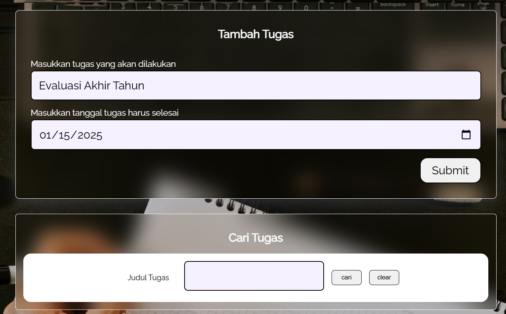
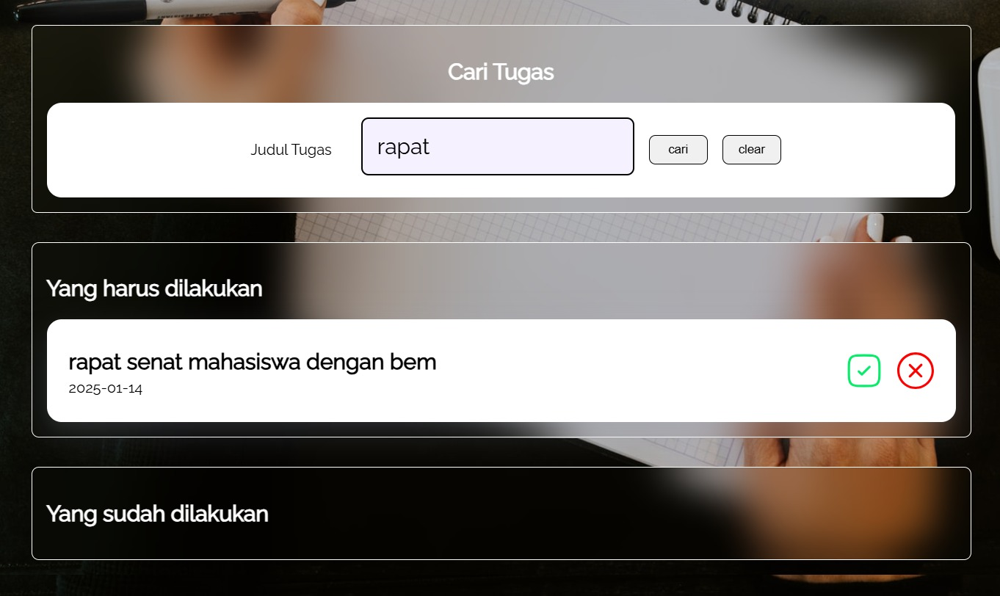
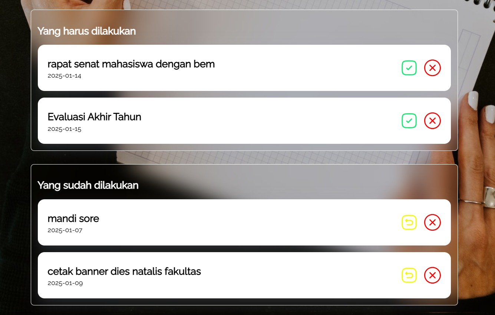

## To Do Apps

  This web-based to-do list project is designed to help users manage their daily tasks easily using HTML, CSS, and JavaScript. 
  JavaScript is used to directly manipulate the elements on the webpage, such as displaying the task list, marking tasks as completed, or removing them. 
  The application also uses the browser's local storage (localStorage) to keep task data saved even after the page is reloaded. With this feature, users can enjoy a simple, fast, and practical 
  experience without the need for additional servers.

## Features 
- **Task Input Form**
  

    
    
In this form, users can input the name of the task to be completed along with the date by which the task must be done.

  

- **Task Search Form**
  

    
    

      This feature allows users to search for tasks that need to be completed or have already been completed. This feature is particularly helpful when the list of tasks to be done and those already 
      completed becomes extensive.
    

  

- **Mark As Done, Undo Mark As Done, and Remove Task**
  

    
    

      This feature allows users to mark a task as complete by pressing the green checklist button. Additionally, users can undo the mark as complete action by pressing the yellow undo button. 
      Finally, users can delete completed tasks by pressing the red delete button.
    

  

